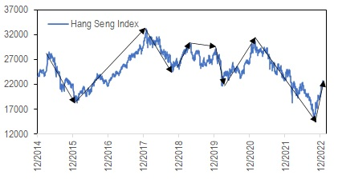
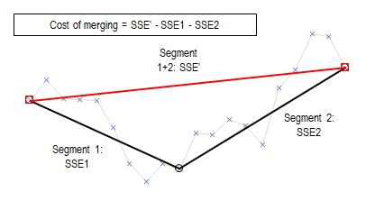
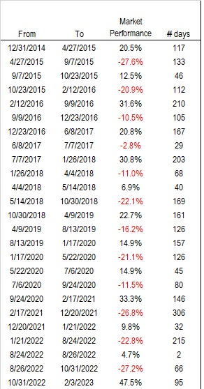
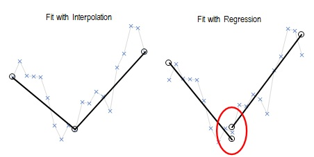

# Time Series Segmentation in VBA

When I was working as an equity strategist, a question that I got asked a lot was "_The market is up by 20% now! Can you tell me how many times in the past did this happen? And what sectors outperformed in those cycles? Thanks!_", sigh. Maybe I am being judgemental, but people who ask these questions are either not very smart, or maybe they are too smart that they see things that I don't.


To illustrate my frustration, let's look at the figure above. Let's say the think line shows a market index from 12/2010 to 3/2011, and see if it fits the description of being "_up by 20%_". So it went up by +50% for the full period. Do we consider it as one +50% period, so it's not a +20% period? Or was it a 3-cycles period where it first went up by 20%, corrected by -7%, then rebound by +34%? For the last +34%, we may just as well break it into two legs of +20% and +14%. As a matter of fact, if this line had infinite resolution, one could sample infinite number of segments from it that fit the "_up by 20%_" description. And as you continue to draw this chart for 20 more years, this segment becomes so small that you may not even consider this as a standalone period at all.

This partly explains why there are so many methods and "indicators" for technical analysis, and why I think they are overrated. One can draw all those fancy lines and arrows on a simple price chart, in many different combinations, but they are all just subjective ways to present the same underlying data, not necessarily giving you consistent conclusions. IMHO, technical analysis are mostly visual tricks to show people what they want to see. I am not saying they never work. If there are enough active investors taking the same action on the same technical analysis, then at some point it would feed on itself, but that goes for any kind of analysis.

In reality, working in the service industry, I could not just tell my clients that they are not as smart as they think they are, because I was paid to be nice. So I have to come up with some answers to the question (refer to the beginning), even if that answer is as dumb as the question. Back in the days, I would just draw a price chart, and through intuition and personal judgement, cut it into different segments and call it a day. An example is shown here using historical closing levels of Hang Seng Index, downloaded from Yahoo Finance.



That's all good until the data is too much to do manually, and time is short if work-life balance is your kind of thing. Another thing is, when you or somebody else repeat the same analysis on another day, one may come up with a different way to cut the segments, since they are arbitrarily decided in the first place. So it would be beneficial to do that with an algorithm, so anyone who do the same analysis would have the same answer as long as the same parameters are used. Programming it also speeds up the process when working with long or multiple series. And that's today's topic, an algorithm for time series segmentation.

The main algorithm described here was discussed in Keogh et al (2004)<sup>1</sup>. The idea is that for any segment of a time series of regular intervals, we can appoximate it with a straight line, which would incur an error, or a cost. The objective is then to segment a time series into pieces of straigh lines, so that the cost is within a predefined tolerance. A common cost function used the sume of squared error (SSE), which is defined as $\sum_i (y_i - y'_{i})^2$, where $y_i$ is the i-th data point in the series and $y'_i$ is its estimated value from linear approximation. If we can do this optimally, we can approximate a time series of N data points, with only M segments, or M+1 data points, which contain the key features of the original time series.



To illustrate the algorithm, look at the figure above. This time series is originially segmented into two lines, Segment1 and Segment2, each with its own SSE. When we merge them into one single segment, the new line has a new SSE, which is typically larger than some of the individal error. So we can say the cost of merging these two segments is the difference between the new SSE and the old SSE's combined. This gives us the building block of the algorithm below:

```
Algorithm: Linear segmentation of time series with regular intervals
Input: time series x = {x_1,x_2,...,x_N}
Output: segment(1:M), integer array pointing to the starting position of each of the M segments

Initialize number of segment M = N-1
Initialize segment = {seg_1,seg_2,...,seg_{N-1}} = {1,2,...,N-1}
Initialize sse = {sse_1, sse_2,...,sse_{N-1}} = {0,0,...,0}
Calculate the cost of merging each consecutive segment and store it in cost = {cost_1, cost_2,...,cost_{N-2}}
Identify the pair of segments that has the lowest cost of merging: cost_{min}

Do
	Merge the two segments min and min+1 by reindexing the arrays: segment, sse and cost
	M = M-1
	Recalculate SSE of the new segment seg_{min}
	Recalculate the two costs of merging the new segment with the segments before and after it: cost_{min-1} and cost_{min}
	Identify a new pair of segments that has the lowest merge cost cost_{min}
	Break if cost_{min} is larger than tolerance or target number of segments is reached
Loop

Output segment
```

Another twist that can be added to the mix is that in some cases, we prefer to merge segments that have slopes in the same direction, over merging slopes with opposite signs. This is because a change in sign of slopes indicates turning point, which is often of particular interest. So we may add a penalty cost to discourage merging segments with opposite slopes.

To test the code, I ran it on the log level of Hang Seng Index as mentioned above. The whole series has 1,993 data points. It's run with the code to approximate it usng 100, 50 and 25 segments, with and without the addition of sign penalty. One can see that although the original series contain almost 2,000 data points, using only 50 or even 25 segments (~97% compression rate) to approximate it already captures most of the essence of its trend. This is because the sampling points are not randomly selected, but systematically chosen to strategically capture linear-like segments.


If the purpose of this appoximation is to perform futher operations like time series indexing and clustering, then more rigorous tests are needed to evalulate its performance. But for our purpose, we simply want to use it to tell a story  of what had happened in the past. So the quality that we look for is its aesthetics. If it looks good and tells the story we want to tell, it's plenty good. And if it's not, we can always tune the parameters until it fits our need. And making manual adjustments from here is also much more efficient than doing everything by hand. With a little excel skills, we could also easily translate the charts into tables like this, just an alternative way to tell the story, which is easier if you need to do some stats on it.



As mentioned in the beginning, how we want the segmentations to come out is totally subjective, this algorithm simply provides a parametric way to do it systematically, so it becomes reproducible and also less of a chore.

The codes and examples used can be found [here](TS_Segmentation.xlsm). The module containing the main function is here.

It's worth pointing out that when creating a linear approximation for a segment, there are two ways to do it: Interpolation and Regression, as illustrated below:



Interpolation is simply joining the end points of a segment, while Regression do that with a simple least square fit. They are implemented in the codes with argument `fitType` which can take the value INTERPOL or REGRESSION. Note that the codes only output the indices of segment startiing points, so even when Regression is used, one can still use the actual data points to make a chart. Since the main purpose here is for visualisation, this is ideal since no gaps will be seen between segments. The effect of choosing Regression vs Interpolation is implicit in the calculation of SSE and cost functions.

References:
1. Eamonn Keogh et al., "Segmenting Time SeriesL A Survey and Novel Approach", Data mining in time series databases 57 (2004): 1-22
